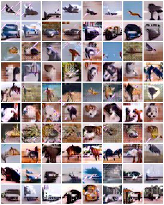

# Drifting Models

Unofficial PyTorch implementation of ["Generative Modeling via Drifting"](https://arxiv.org/abs/2602.04770).

Just for fun and learning. Feel free to test and pull request~

**One-step generation** - no iterative sampling required (1-NFE).

## Method

Drifting Models train a generator by computing a *drifting field* V that points generated samples toward real data and away from other generated samples. The loss is simply `||V||^2`, which reaches zero when generated samples are indistinguishable from real data.

Key components:
- **DiT-style generator** with adaLN-Zero conditioning
- **Drifting field V** computed via soft assignment matrices (Algorithm 2)
- **Multi-temperature** V computation for multi-scale structure
- **Classifier-free guidance (CFG)** support

## Requirements

```bash
pip install torch torchvision einops
```

## TODO
- [x] Support MNIST and CIFAR-10
- [ ] Support ImageNet

## Usage

### Training

```bash
# MNIST (pixel space, ~20 min on GPU)
python train.py --dataset mnist

# CIFAR-10 (with feature encoder)
python train.py --dataset cifar10
```

### Sampling

```bash
python sample.py --checkpoint outputs/mnist/checkpoint_final.pt --dataset mnist
```

## Results

MNIST samples after ~8000 steps:


CIFAR-10 samples after ~8500 steps:



## Project Structure

```
├── model.py            # DiT-style generator
├── drifting.py         # Drifting field V computation
├── feature_encoder.py  # CNN feature encoder (for CIFAR)
├── train.py            # Training loop
├── sample.py           # Sampling script
└── utils.py            # EMA, utilities
```

## Key Hyperparameters

| Parameter | MNIST | CIFAR-10 |
|-----------|-------|----------|
| Model | DriftDiT-Tiny (9M) | DriftDiT-Small (27M) |
| Epochs | 100 | 200 |
| LR | 2e-4 | 2e-4 |
| Temperatures | [0.02, 0.05, 0.2] | [0.02, 0.05, 0.2] |
| Feature space | Pixel (L2 norm) | CNN encoder |


